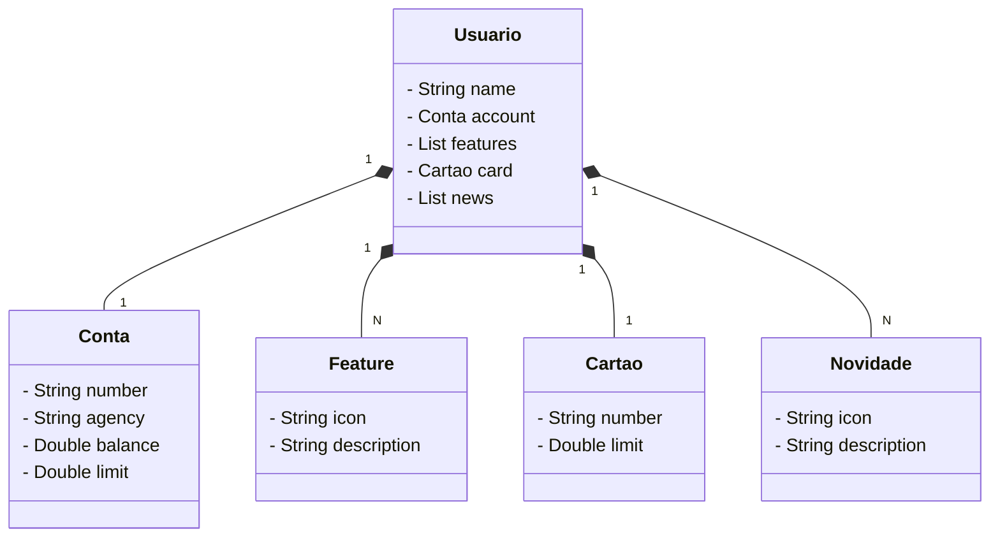

# Santander Dev Week 2023
Java RESTful API craiada para Santander Dev Week.

## Diagrama de Classes

```mermaid
classDiagram
  class Usuario {
    - String name
    - Conta account
    - List<Feature> features
    - Cartao card
    - List<Novidade> news
  }

  class Conta {
    - String number
    - String agency
    - Double balance
    - Double limit
  }

  class Feature {
    - String icon
    - String description
  }

  class Cartao {
    - String number
    - Double limit
  }

  class Novidade {
    - String icon
    - String description
  }

  Usuario "1" *-- "1"Conta
  Usuario "1" *-- "N" Feature
  Usuario "1" *-- "1" Cartao
  Usuario "1" *-- "N" Novidade
```

